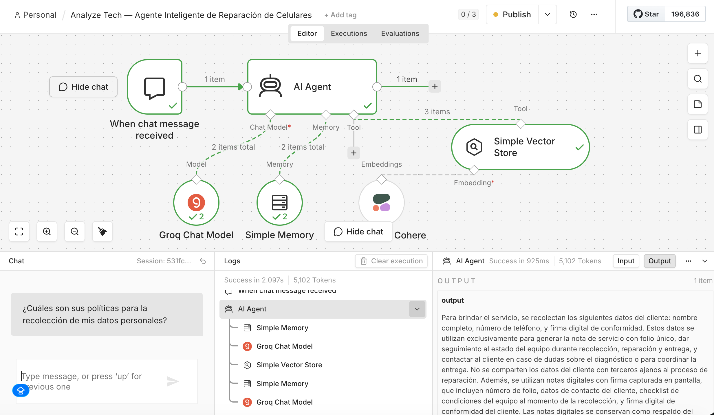
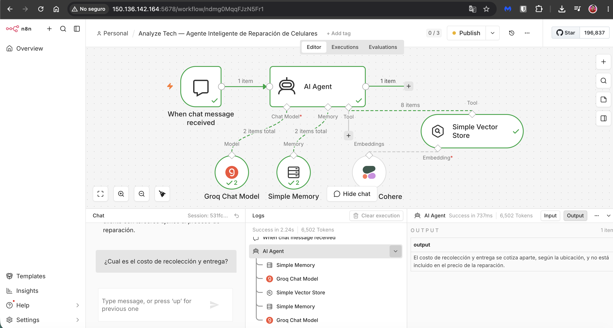
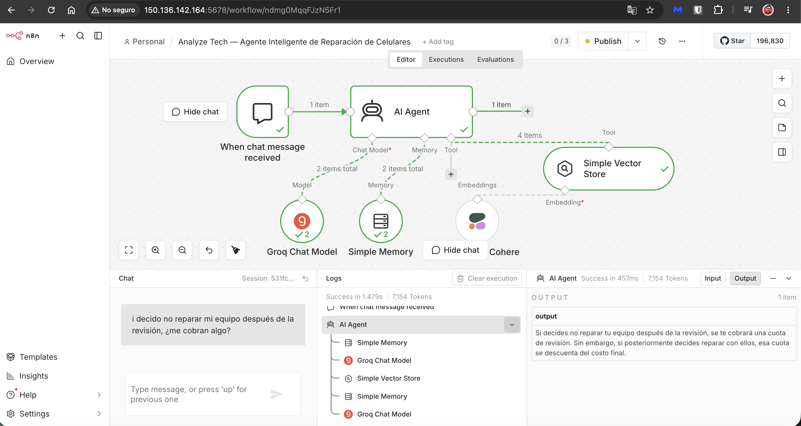
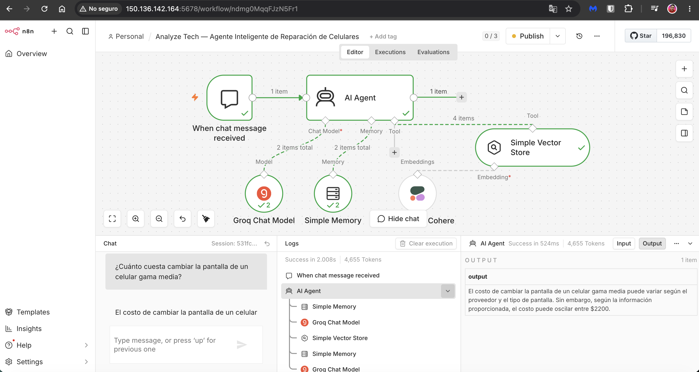
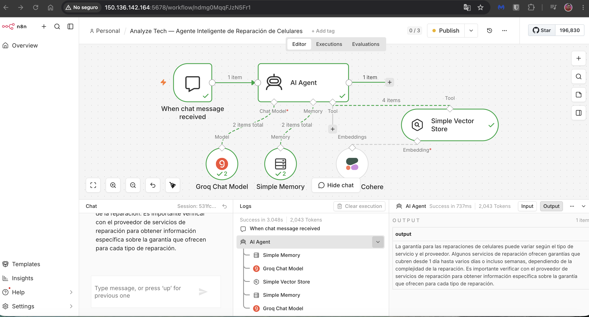

# Analyze Tech — Agente Inteligente de Reparación de Celulares

Agente conversacional basado en RAG (Retrieval-Augmented Generation) que responde preguntas en lenguaje natural sobre los servicios de un negocio de reparación de celulares: tipos de reparación, precios, tiempos de entrega, garantías y políticas de servicio.

Proyecto desarrollado como parte del **Challenge Alura Agente — ONE AI FOR TECH** (Oracle Next Education).

## 🎯 Objetivo

Construir un agente de IA que:
- Responda preguntas de clientes usando una base de conocimiento real (documentos del negocio).
- Esté desplegado y accesible públicamente en la nube.
- Cuente con documentación clara de arquitectura y uso.

## 🏗️ Arquitectura

El sistema se compone de las siguientes capas:

| Componente | Tecnología | Rol |
|---|---|---|
| Infraestructura | Oracle Cloud Infrastructure (OCI) — Compute, modelo **IaaS** | Servidor virtual (Ubuntu) donde corre toda la aplicación |
| Orquestación | Docker | Contenedor que aísla y ejecuta n8n |
| Motor de automatización / agente | n8n (self-hosted) | Construcción visual del flujo del agente (chat, RAG, memoria) |
| Modelo de lenguaje (LLM) | Groq (Llama 3.3 70B) | Genera las respuestas del agente |
| Embeddings | Cohere (Embed Multilingual v3.0) | Convierte los documentos y preguntas a vectores semánticos en español |
| Base de conocimiento | Vector Store en memoria (n8n) | Almacena los documentos indexados para búsqueda semántica |
| Interfaz | Chat público de n8n | Punto de acceso para que cualquier usuario hable con el agente |

**¿Por qué esta arquitectura?**

Se optó por **OCI Compute (IaaS)** en lugar de un servicio administrado, para tener control total sobre la configuración del entorno y cumplir con el requisito de despliegue en OCI del Challenge. Se eligió **n8n** como motor del agente por su enfoque visual, que permite construir flujos RAG complejos (documentos → embeddings → búsqueda vectorial → LLM) sin escribir código, ideal para iterar rápido bajo tiempo limitado. **Groq** y **Cohere** se seleccionaron por ofrecer capas gratuitas suficientes para el alcance del proyecto y buen soporte multilingüe.


## 🧠 Cómo funciona el RAG (Retrieval-Augmented Generation)
El agente no responde de memoria ni improvisa: cada respuesta se basa en documentos reales del negocio, indexados y recuperados por significado semántico. El proceso ocurre en dos flujos separados dentro de n8n:

### Flujo 1 — Carga de documentos (`Carga-documentos.json`)
Se ejecuta manualmente para construir la base de conocimiento:

1. **Extracción**: dos nodos HTTP Request obtienen el contenido en crudo de los documentos alojados en este mismo repositorio (FAQ, precios, términos, política de datos).
2. **Unificación**: un nodo Merge combina todos los documentos en un único flujo de datos.
3. **Fragmentación**: un Text Splitter divide los documentos en fragmentos de ~1000 caracteres (con 200 de traslape), para que cada fragmento contenga una idea completa y sea fácil de recuperar con precisión.
4. **Vectorización**: cada fragmento se convierte en un embedding (vector numérico de 1024 dimensiones) mediante **Cohere Embed-Multilingual-v3.0**, que representa el significado del texto en español, no solo las palabras.
5. **Almacenamiento**: los vectores resultantes se guardan en un Vector Store en memoria, listo para búsquedas por similitud semántica.

### Flujo 2 — Agente conversacional (`agente-chat.json`)
Se activa cada vez que un usuario envía un mensaje:

1. El mensaje del usuario llega mediante el nodo de chat (interfaz pública).
2. El **AI Agent** decide, según la pregunta, si necesita consultar la base de conocimiento (herramienta RAG) antes de responder.
3. Si es necesario, convierte la pregunta a un embedding con el mismo modelo de Cohere, y busca en el Vector Store los fragmentos con significado más cercano.
4. Esos fragmentos recuperados se entregan como contexto al modelo de lenguaje (**Groq — Llama 3.3 70B**), que genera la respuesta final basada en información real, no inventada.
5. Una memoria de sesión (Simple Memory) permite que el agente mantenga contexto durante la conversación.

**Nota de diseño:** el Vector Store usado (Simple Vector Store) almacena los datos en memoria del contenedor, no en disco. Esto significa que si el contenedor de n8n se reinicia, es necesario volver a ejecutar el Flujo 1 (Carga de documentos) para reconstruir la base de conocimiento. Se optó por esta solución por su simplicidad de configuración, adecuada al alcance y tiempo del Challenge; para producción real se recomendaría una base vectorial persistente (ej. Postgres + PGVector).


## 🛠️ Tecnologías y herramientas utilizadas

| Categoría | Herramienta |
|---|---|
| Cloud / Infraestructura | Oracle Cloud Infrastructure (Compute, IaaS) |
| Contenerización | Docker |
| Automatización / Orquestación del agente | n8n (self-hosted) |
| Modelo de lenguaje (LLM) | Groq — Llama 3.3 70B Versatile |
| Embeddings | Cohere — Embed Multilingual v3.0 |
| Control de versiones | Git / GitHub |
| Sistema operativo del servidor | Ubuntu 20.04 |


## 🚀 Instrucciones para ejecutar el proyecto

### Requisitos previos
- Cuenta de Oracle Cloud Infrastructure (capa Always Free).
- Cuenta gratuita en [Groq](https://console.groq.com) y [Cohere](https://dashboard.cohere.com).
- Docker instalado en el servidor.

### Pasos

1. **Levantar el servidor**: crear una instancia Compute en OCI (Ubuntu, shape Always Free) y conectarse por SSH.
2. **Instalar Docker**:
```bash
   curl -fsSL https://get.docker.com -o get-docker.sh
   sudo sh get-docker.sh
   sudo usermod -aG docker $USER
```
3. **Levantar n8n**:
```bash
   docker run -d --name n8n --restart unless-stopped -p 5678:5678 \
     -v ~/n8n-data:/home/node/.n8n \
     -e N8N_SECURE_COOKIE=false \
     -e WEBHOOK_URL=http://TU_IP_PUBLICA:5678/ \
     -e N8N_EDITOR_BASE_URL=http://TU_IP_PUBLICA:5678/ \
     docker.n8n.io/n8nio/n8n
```
4. **Abrir el puerto 5678** en la Security List de OCI (Ingress Rule, TCP, `0.0.0.0/0`) y en el firewall interno del servidor:
```bash
   sudo iptables -I INPUT -p tcp --dport 5678 -j ACCEPT
```
5. **Importar los flujos**: entrar a `http://TU_IP_PUBLICA:5678`, crear la cuenta de owner, e importar `n8n-workflow/agente-chat.json` y `n8n-workflow/Carga-documentos.json`.
6. **Configurar credenciales**: agregar las API Keys de Groq y Cohere en n8n (Credentials → New).
7. **Cargar la base de conocimiento**: ejecutar manualmente el flujo `Carga-documentos.json` (botón "Execute workflow").
8. **Publicar y usar el agente**: en el flujo `agente-chat.json`, publicar el workflow y abrir el chat público con el botón "Open chat".


## Ejemplos de uso

El agente responde en tiempo real consultando la base de conocimiento (RAG) desplegada en OCI.
Las capturas incluyen URL pública del proyecto: **`http://150.136.142.164:5678/`**

### Política de datos personales
**Pregunta:** ¿Cuáles son sus políticas para la recolección de mis datos personales?



### Costo de recolección y entrega
**Pregunta:** ¿Cuál es el costo de recolección y entrega?



### Cancelación tras revisión
**Pregunta:** Si decido no reparar mi equipo después de la revisión, ¿me cobran algo?



### Precio de reparación
**Pregunta:** ¿Cuánto cuesta cambiar la pantalla de un celular gama media?



### Garantías
**Pregunta:** ¿Qué garantía tienen las reparaciones?



## 📋 Estado del proyecto

- [x] Infraestructura desplegada en OCI (Compute, VM.Standard.E2.1.Micro, Ubuntu)
- [x] n8n instalado vía Docker y accesible públicamente
- [x] Flujo base del agente (Chat → AI Agent → Groq + Memoria + Vector Store)
- [ ] Carga de documentos a la base de conocimiento
- [ ] Pruebas de respuesta del agente
- [ ] Video/captura de evidencia funcionando en la nube
